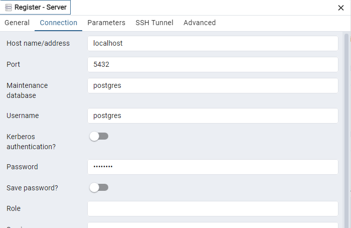

# points-of-interest
# Node.js REST API

## Challenge Submission

### Completed During Challenge
- Defined API contracts
- Set up swagger for API documentation
- Defined database schema
- Added basic validation with Joi
- Example unit test file with Jest
- Made API functional with in-memory data

### Post-Challenge Improvements
- Set up Postgres connection
- Dockerised API and dabatase for easier setup
- Implemented API Service class so that the API can communicate with a real database instead of in-memory storage
- Added seeding scripts to populate database with the possible working hour schedules and some point of interest test data

## Overview

This API simulates a manager of points of interest.

It was written using expressJS and typescript, with support from ```awilix``` for dependency injection functionality.

## Installing dependencies
In the root directory, run ```npm install```.
The application requires ```docker``` and ```docker-compose``` to run.

## Running the application
To run the application, execute the following from your terminal: ```./scripts/rebuild.sh```. This wil create a docker container where the application runs alongside a Postgres database.

To verify that the API started up successfully, access http://localhost:3000/health in your browser. You should see the message ```API is up and running```.

To verify that the Database server was created successfully and is operational, you can use a tool like pgAdmin. Use the following credentials to connect to the server:



## Seeding the application
Before using the API, it is necessary to populate the database with the possible POI working hour schedules:
```
● Opening Hours: Configurable for different operational patterns:
● Case One: Open Monday to Friday from 8 AM to 8 PM, Saturdays from 8
AM to 6 PM, closed on Sundays and public holidays.
● Case Two: Open daily, including public holidays.
● Case Three: Open Monday to Thursday 6 AM to 8PM, Fridays from 6AM to
4 PM, closed on Saturdays, Sundays and public holidays
```

To do this, open a terminal in the application's root folder, and run ```npm seed:opening-hours```.

You can also seed point of interest data by running ```npm seed:poi```.

## Manual testing
Although Swagger docs was setup (available in http://localhost:3000/api-docs/), due to the timeframe of the challenge I prioritised expanding other parts of the codebase over completing the documentation. Hence some of the endpoints in swagger are not testable.

An alternative is to refer to the ```.http``` file in the root folder and use a client like Postman with the example requests and payloads provided. I used [VSCode's REST Client](https://marketplace.visualstudio.com/items?itemName=humao.rest-client).

The application will be running on localhost and on port 3000 by default. You can also access its swagger docs page at http://localhost:3000/api-docs/.

## Automated Testing
Tests can be executed by running ```npm run test```.

Due to time constraints I chose to implement more functionality, but for illustration purposes I created a unit test script for the controller class. With the architecture of the application, unit tests for the service and repository classes would be very similar in logic. In addition to this, I also provided some examples of integration tests.

## Libraries used
* ```joi``` - to validate incoming request payloads.
* ```awilix``` - to build a container with all of my components and facilitate injecting dependencies into them. With its dependency injection capabilities, we are able to achieve modularity and more efficient testing of our dependencies.

## Implementation choices:
* Use of ``'simple-json'`` type table columns

While convenient, storing column data in json format has some trade-offs such as more difficult querying in complex queries and no validation of the contained data. However, in the context of this challenge I chose to use 'simple-json' to define a column in the two tables of this database. There were two reasons for this:

1. Implementing normalisation and adding functionality to manage data in these two tables would have taken additional time that I could spend showcasing other functionalities.
2. The challenge did not have performance requirements for these two columns. For example, if there was a request to implement an endpoint to fetch "Which points of interest have a pump with Diesel" or "Which points of interest are currently open", I might have prefered creating additional tables and writing cleaner SQL queries that could be more beneficial to handle heavy loads.

## Additional improvements:
Improvements for this version that could have been implemented with more time:

- setup ESLint to promote code quality and consistency in the codebase
- complete the joi schema for validating incoming payloads
- PATCH endpoint to toggle point of interest OFFLINE and ONLINE status.
- unit tests for service and repository methods
- Handle additional error codes (For example throw a 409 when we try to create a point of interest with a name that already exists).
- Monitoring: Create a custom logging class, with different levels of logging, to improve monitoring and reduce cluttering.
- Setup environment variables such as API ports, database connection details, logging level
- Complete Swagger API docs
- Use caching to retrieve frequently accessed data and reduce the load on our database

